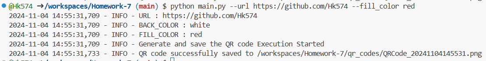
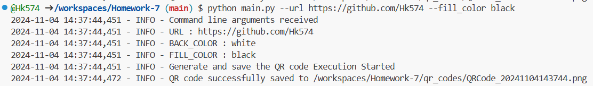
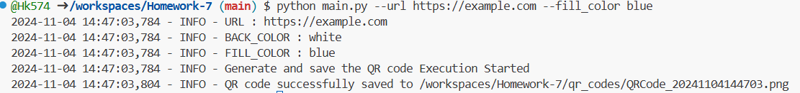
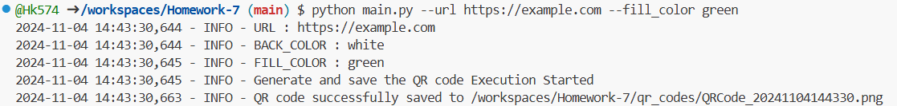

# QR Code Generator

## Overview
This project generates QR codes from a given URL, allowing customization of fill and background colors. The generated QR codes are saved to a specified directory.

## QR Code Examples

### 1. URL (https://github.com/bb472)
### 1.1 Back Color: White | Fill Color: Red  

**Logs Image**

### 1.2 Back Color: White | Fill Color: Black  

**Logs Image**

### 2. URL(https://example.com)

### 2.1 Back Color: White | Fill Color: Blue  

**Logs Image**

### 2.2 Back Color: White | Fill Color: Green  

**Logs Image**

